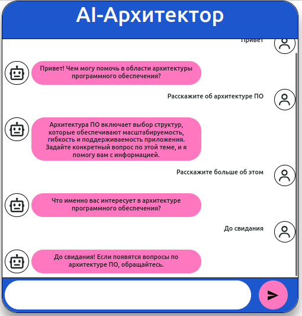

# Проектная работы 5


## Сдача решения
```
- Настройте логирование всех запросов в конфиге Rasa. Запустите Rasa командой с параметрами rasa run --log-level DEBUG
  логи отображаются в терминале. Это основной способ просмотра логов в режиме реального времени.
- Поприветствуйте ассистента в UI веб-приложения. Проконсультируйтесь с ним на тему микросервисной архитектуры (
  например, что это такое и как её реализовать).
- Выгрузите лог Rasa в GitHub и сделайте пул-реквест.

Если всё готово, отправьте ссылку на репозиторий во вкладке «Ревью».
Не забудьте проверить, что репозиторий публичный. Если отправите ссылку на приватный репозиторий, ревьюер не сможет
прокомментировать ваше решение и вернёт его на доработку.
После того как отправите ссылку, не вносите изменения в проект. Дождитесь комментариев ревьюера.
```
## Логи в файле rasa_requests.log



